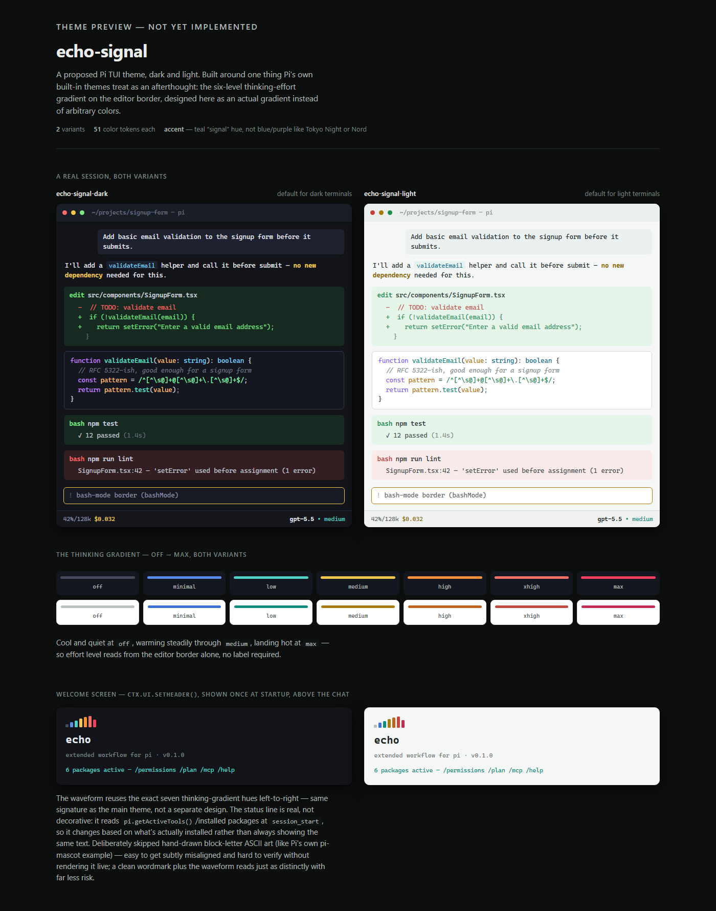
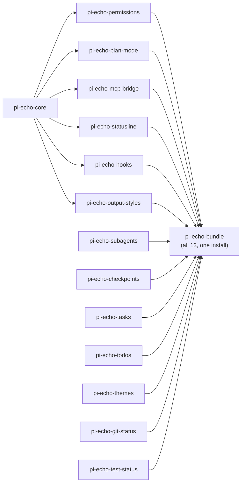

# echo

`echo` is a set of installable packages ("Pi packages") for the [`pi`](https://github.com/earendil-works/pi) coding-agent CLI (`@earendil-works/pi-coding-agent`) that layer a fuller workflow on top of Pi's minimal core — a permission gate, plan mode, sub-agents, checkpoints, background tasks, a todo list, output-style switching, no-code hooks, a status line, an MCP bridge, a CI wrapper, a theme pack, and a few small always-visible status widgets (git branch, test/build pass-fail, MCP connection health). Pi's own README states plainly that it "ships powerful defaults but skips features like sub agents and plan mode," expecting third parties to build those as packages. This is that package — coding-domain only, no chat-product chrome.



**Who this is for:** anyone using plain `pi` who wants a fuller set of guardrails and workflow features on top of it — a permission gate, plan mode, checkpoints, sub-agents, and the rest.

Nothing here makes Pi "safe" in an absolute sense. Every package is a cooperative, in-process layer of friction and auditability on top of what Pi already grants — see `SECURITY.md` for exactly what each package does and does not protect against, stated plainly rather than implied.

## Packages

| Package | Adds |
|---|---|
| `pi-echo-core` | Shared types, the pure permission-decision function, and policy/state file I/O — no extension itself, a library the others depend on. |
| `pi-echo-permissions` | A cooperative gate on every tool call: five-way mode (`manual`/`acceptEdits`/`plan`/`dontAsk`/`bypass`) + allow/ask/deny rules + protected paths that can't be overridden even in `bypass` mode. |
| `pi-echo-plan-mode` | Read-only exploration mode with a model-callable `exit_plan_mode` approval gate, sharing its mode flag with `pi-echo-permissions`. |
| `pi-echo-subagents` | Delegates tasks to specialized subagents with true OS-level context isolation (each runs as a separate `pi` process), single/parallel/chain modes, `.md`-frontmatter agent definitions. |
| `pi-echo-checkpoints` | Git-stash-based per-turn snapshots plus an explicit `/rewind [n]` command. |
| `pi-echo-tasks` | Background job tool (`run_task`/`task_status`/`kill_task`) for processes Pi's synchronous `bash` tool can't handle. |
| `pi-echo-todos` | A general-purpose, model-callable todo list (`todo_write`), rendered as a persistent widget. |
| `pi-echo-output-styles` | Command-driven persona/tone switching (`concise`/`explanatory`/`learning` built in, plus project-local custom styles). |
| `pi-echo-mcp-bridge` | Connects to MCP servers over stdio (via the official `@modelcontextprotocol/sdk`) and registers their tools as regular Pi tools, automatically gated by `pi-echo-permissions`. |
| `pi-echo-hooks` | No-code, JSON-configured lifecycle hooks (`PreToolUse`/`PostToolUse`/`UserPromptSubmit`/`SessionStart`/`SessionEnd`/`Stop`) — declare a shell command per event in a config file, no extension code required. |
| `pi-echo-statusline` | Configurable status line rendered from one shell command's output. |
| `pi-echo-ci` | A standalone CLI (not a Pi extension) wrapping `pi --mode json -p` with a structured summary and documented exit codes, for CI/headless use. |
| `pi-echo-themes` | The `echo-signal` dark/light theme pair (teal accent, a deliberately-designed 7-step thinking-level gradient) plus a matching theme-adaptive welcome header. |
| `pi-echo-git-status` | Persistent footer badge showing the current git branch and dirty/clean state, refreshed each turn. |
| `pi-echo-test-status` | Persistent footer badge showing pass/fail (`✓`/`✗`) from the last test/build bash command. |
| `pi-echo-bundle` | Installs and registers all thirteen extensions above in one shot (plus the `pi-echo-themes` theme pack) — for "give me everything" instead of picking packages individually. |

## How the packages fit together

`pi-echo-core` is the only shared dependency — six packages build directly
on it, and `pi-echo-bundle` pulls in all thirteen feature packages at once:



`pi-echo-ci` isn't pictured — it's a standalone CLI wrapping `pi`, not a Pi
extension, so it doesn't depend on `pi-echo-core` or plug into the bundle.

## Quickstart

Every package is live on the public npm registry — install straight from
there, no cloning required:

```bash
npm install -g @earendil-works/pi-coding-agent   # tested against 0.84.0

# Install one package, project-local:
pi install npm:pi-echo-permissions -l
pi install npm:pi-echo-plan-mode -l

# ...or everything at once (all 13 feature packages + the theme pack):
pi install npm:pi-echo-bundle -l

# Plain npm also works, same packages:
npm install pi-echo-permissions pi-echo-plan-mode
```

Each of the thirteen feature packages is independently installable — pulling in `pi-echo-permissions` does not require `pi-echo-subagents`, etc. `pi-echo-bundle` is purely additive on top of that (see its own `README.md` for the one real trade-off it makes: Pi's loader sees it as a single extension, not thirteen independently identifiable ones). See each package's own `README.md` for its design note and any real limitations found while building it (several were found by actually running the code against a live `pi` process, not just type-checking — worth reading if you're deciding whether to trust a given package).

### Building from source

For contributing, or trying a change before it's published — clone and use
the convenience installer, which calls `pi install <local-path>` instead of
copying files (several packages depend on `pi-echo-core` as a real npm
dependency and need the workspace built first):

```bash
git clone <this repo> && cd echo
./install.sh                  # everything, global (available in every project)
./install.sh permissions      # just pi-echo-permissions
./install.sh permissions -l   # just pi-echo-permissions, project-local
```

Or by hand:

```bash
git clone <this repo> && cd echo && npm install && npm run build

# Try extensions without installing them (temp-loaded for this run only):
pi -e ./packages/pi-echo-permissions -e ./packages/pi-echo-plan-mode
# ...or everything at once:
pi -e ./packages/pi-echo-bundle

# Install for real, project-local, from your local build:
pi install ./packages/pi-echo-permissions -l
pi install ./packages/pi-echo-plan-mode -l
```

## What stock Pi doesn't have

Verified against the actual installed `@earendil-works/pi-coding-agent` package (`0.84.0`), not assumed from docs:

| Capability | Stock Pi | `echo`-on-Pi |
|---|---|---|
| Permission gate | None | ✅ 5-mode + rules + protected paths |
| Plan mode | None | ✅ + model-callable approval tool |
| Sub-agents | None | ✅ subprocess-isolated |
| Checkpoints | None | ✅ git-stash + `/rewind` |
| Background tasks | None (bash always awaits completion) | ✅ |
| Todo tracking | None | ✅ |
| Output styles | None | ✅ (appends, doesn't replace default prompt) |
| MCP | None (confirmed absent from core; community bridges exist) | ✅ via official SDK |
| No-code hooks | None (a Pi "hook" means writing an extension) | ✅ `pi-echo-hooks` — declarative, config-file only |
| Status line | None natively (only a code-it-yourself example) | ✅ `pi-echo-statusline` — one configured command |
| CI/headless wrapper | Print/JSON/RPC modes exist, no structured exit-code convention | ✅ `pi-echo-ci` |
| Custom theme pack | Theme system exists, no bundled theme built for this purpose | ✅ `pi-echo-themes` — dark/light pair + welcome header |
| Git/test status at a glance | Footer shows model/thinking/tokens/cost only | ✅ `pi-echo-git-status` + `pi-echo-test-status` badges |

## Docs

- `SECURITY.md` — what each package actually protects against, and what it explicitly does not.
- `docs/MIGRATION.md` — bringing agent definitions, hooks, permission rules, and skills over from another agent CLI with similarly-shaped features.
- `PROGRESS.md` — the authoritative current-state log: what's built, tested, and published, updated after every session.

## License

[MIT](LICENSE) &copy; Sumanth Hegde

## 👥 Contributing

`echo` is a real npm-workspaces monorepo — TypeScript, real tests, real builds. To contribute:

1. Create a branch: `feature/your-topic` (or `fix/your-topic`)
2. `npm install && npm run build && npm test` at the repo root before opening a PR
3. If behavior changes, update the affected package's own `README.md` "Design note" section too
4. Open a Pull Request with a short description of what changed and why

> 💡 Found a real bug by actually running a package against a live `pi` session? That's the most valuable kind of finding here — several packages' READMEs already document exactly that pattern (a design note plus the bug it caught).

## 🔗 Official Resources

- [Pi repository](https://github.com/earendil-works/pi)
- [Pi extensions docs](https://github.com/earendil-works/pi/blob/main/packages/coding-agent/docs/extensions.md)
- [Pi packages docs](https://github.com/earendil-works/pi/blob/main/packages/coding-agent/docs/packages.md)
- [Pi security docs](https://github.com/earendil-works/pi/blob/main/packages/coding-agent/docs/security.md)
- [Model Context Protocol](https://modelcontextprotocol.io)

## 📬 Questions?

**Sumanth Hegde**

- 📧 Personal: hegdesumanth8@gmail.com
- 📧 Work: sumanth.hegde@absyz.com
- 💼 LinkedIn: [linkedin.com/in/hegde-sumanth](https://www.linkedin.com/in/hegde-sumanth/)
- 🐙 GitHub: [github.com/hegdesumanth](https://github.com/hegdesumanth)
- 🌐 Portfolio: [hegdesumanth.netlify.app](https://hegdesumanth.netlify.app/)

---

*Prepared and maintained by **Sumanth Hegde**.*
