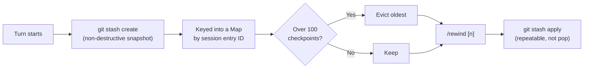

# pi-echo-checkpoints

Git-stash-based per-turn checkpointing, adapted from Pi's own official `git-checkpoint.ts` example, plus an explicit `/rewind` command.

## Design note

Uses `pi.exec("git", ["stash", "create"])` at the start of every turn — non-destructive, snapshots the working tree without touching it. Restore uses `git stash apply <ref>` (not `pop`), so restoring is itself repeatable. This is **not a version-control replacement**: no commit history, no diffing between checkpoints, just one working-tree snapshot per turn, bounded to the last 100 (a Map-eviction cap that keeps retention bounded without unbounded growth).

Because `git stash create` snapshots the whole working tree regardless of cause, **bash-driven changes are captured here too**, not just `edit`/`write`-tool-driven ones — broader coverage than an edit/write-only checkpoint scheme would give.

Known limitations, stated plainly rather than glossed over:
- The very first turn in a brand-new session has no checkpoint (the current-entry tracking only populates after the first `tool_result` fires — inherited from the official example, not new here).
- A checkpoint is a filesystem snapshot, not session-scoped, so it correctly captures pre-subagent state — but a subagent's own `pi --no-session` child process never registers checkpoints of its own turns.
- **Requires the project to actually be a git repository.** `git stash create` fails with a non-zero exit code (verified: exit 128, `fatal: not a git repository`) outside one — `pi.exec` resolves normally with empty `stdout` rather than throwing, so this degrades to a harmless no-op (no checkpoints recorded, `/rewind` reports none available) rather than crashing a turn. This is not a hypothetical: the `echo` monorepo itself is not a git repository as of Phase B, so this package is presently a no-op there until `git init` is run.

## Install

```bash
pi install npm:pi-echo-checkpoints -l
```

## Checkpoint flow



## Usage

```
/rewind          # list recent checkpoints reachable from the current session branch, pick one interactively
/rewind 3         # restore directly to checkpoint #3 from that list (needed in headless mode, where there's no picker)
```

Forking a session (`/fork` or similar) still offers the official example's reactive restore prompt independently of `/rewind`.
