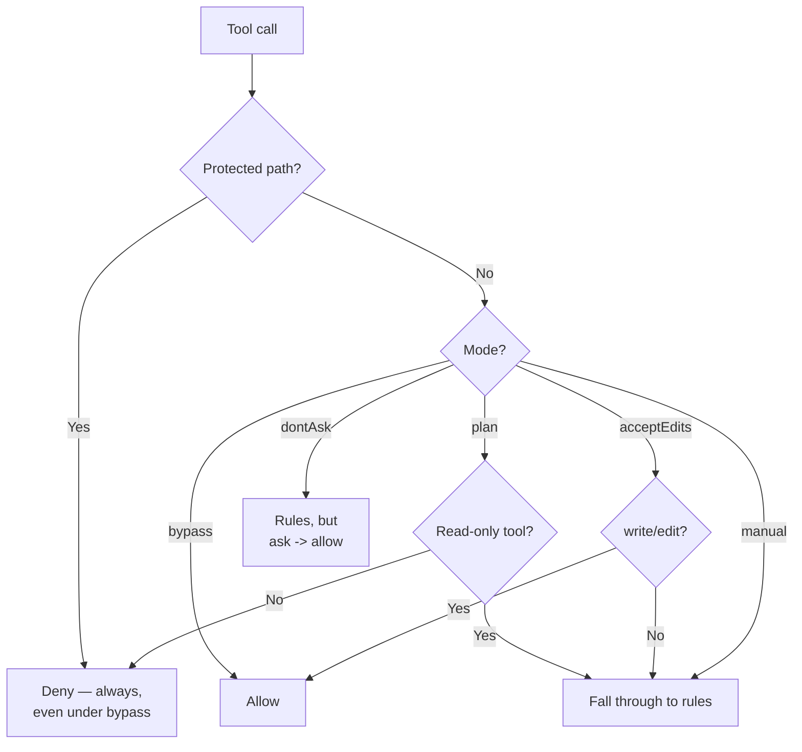

# pi-echo-permissions

A cooperative permission gate for every Pi tool call, backed by `pi-echo-core`'s shared `permissions.json`/`state.json` files.

## Design note

`pi-echo-permissions` uses `pi.on("tool_call", ...)` plus `ctx.ui.select`/`ctx.hasUI` as its entire enforcement surface — the same mechanism as Pi's own official `permission-gate.ts`/`protected-paths.ts` examples, generalized here to every tool rather than a hardcoded subset. It deliberately does not try to be an OS-level sandbox: a bash command it allows can still do anything a shell can do, and any future extension that adds a filesystem- or network-touching tool without going through the standard `tool_call` path is invisible to it by construction, not by oversight. It also does not attempt comprehensive command-injection detection for bash — chained commands, `$()` substitution, and curl-pipe-to-shell are matched against plain regexes/substrings, which is a documented limitation exercised in `docs/testing/echo-permissions-transcript.md`, not something assumed away. See `SECURITY.md` at the repo root for the full threat model.

## Decision order

`evaluate()` checks these in a fixed order — protected paths win regardless of mode, including under `bypass`:



## Install

```bash
pi install npm:pi-echo-permissions -l
```

For local development, load it unpublished instead: `pi -e ./packages/pi-echo-permissions`.

## Usage

```
/permissions status
/permissions mode <manual|acceptEdits|plan|dontAsk|bypass> [-g]
/permissions allow|deny|ask <tool> [pattern] [-g]
```

`-g` targets global scope (`~/.pi/agent/echo/`); omitted, commands write to project scope (`.pi/echo/`).

Every tool call is evaluated fresh against the current policy/state on disk — there is no in-memory cache — so a `/plan` toggle from `pi-echo-plan-mode` (or a `/permissions mode` change) takes effect on the very next tool call with zero coupling between the two packages.

### What's actually on disk

`permissions.json` (project scope: `.pi/echo/permissions.json`, or global under `~/.pi/agent/echo/`):

```json
{
  "rules": [
    { "tool": "bash", "pattern": "rm -rf*", "decision": "deny" },
    { "tool": "bash", "decision": "ask" },
    { "tool": "write", "decision": "allow" }
  ],
  "protectedPaths": [".pi/echo/permissions.json", ".pi/echo/state.json"]
}
```

`state.json`:

```json
{ "mode": "acceptEdits", "lastModeChangeEntryId": "a1b2c3" }
```

`/permissions allow bash "git push*"` appends a rule to whichever scope you targeted; `/permissions mode dontAsk` rewrites `state.json`'s `mode` field — both are the read-modify-write cycle `pi-echo-core` exposes, not hand-edited files (though hand-editing works too, since it's plain JSON).

## A real bug found on review, fixed

`/permissions allow|deny|ask` used to read via `pi-echo-core`'s `readPermissions()` — which returns a **merged** project+global view, by design, for `evaluate()` to use — and write that merged result straight back to a single scope. Every call to `/permissions allow bash` (project scope, the default) was silently copying the entire global rule list into the project's `permissions.json` too. Effects: duplicated rules accumulating on every invocation, and a project file that silently drifted out of sync with the global file it had copied from (editing the global rule set later had no effect on the stale copy already baked into the project file). Fixed by adding `pi-echo-core`'s `readScopedPermissions(cwd, scope)` — an unmerged, single-scope read — and using that as the base for the read-modify-write cycle instead. Covered by a regression test in `pi-echo-core`'s own test suite.
